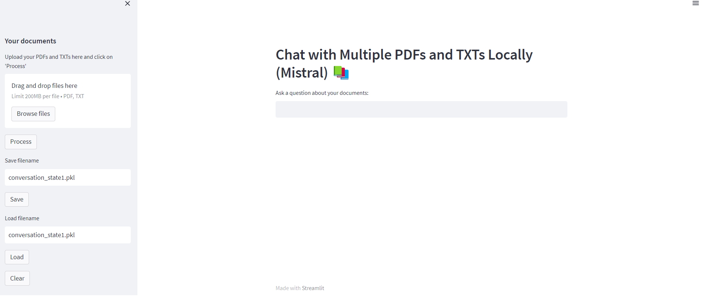

# Repository Description

This repository contains an implementation of an offline Retrieval-Augmented Generation (RAG) model for a Document Chatbot, providing Conversational AI capabilities for multiformat PDFs, TXTs, and GZIP files.. The model combines cutting-edge technologies and tools to provide a robust, interactive, and efficient document querying system. Users can upload multiple document formats, including PDFs, plain text files, and gzip-compressed text files, and interact with the documents through a conversational AI interface.

## Key Technologies and Tools

- **[Ollama](https://ollama.com/)**: Used for large language models and embeddings.
- **[Langchain](https://www.langchain.com/)**: Provides the framework for building applications with language models.
- **[Mistral](https://mistral.ai/)**: A state-of-the-art language model used for generating responses.
- **[FAISS](https://ai.meta.com/tools/faiss/)**: A library for efficient similarity search and clustering of dense vectors.
- **[Streamlit](https://streamlit.io/)**: An open-source app framework for Machine Learning and Data Science teams to create interactive web applications.


## Main Model Description

This model utilizes the Ollama software tool to run large language models (LLMs) locally on a computer, enabling offline language processing tasks. Ollama provides access to a diverse set of pre-trained LLM models. Langchain complements Ollama by acting as a framework, allowing developers to integrate these locally-run LLMs into applications. This makes the LLMs easier to use and build upon. Langchain goes a step further by enabling the development of RAG systems, which use various tools to process information, resulting in more refined and informative responses from the language model.


## Extra Features

- **Multi-format Document Support:** Upload and process PDFs, TXTs, and TXT.GZ files.
- **Text Chunking:** Efficiently splits large texts into manageable chunks for better processing.
- **Vector Store Creation:** Uses FAISS to create a vector store of document embeddings.
- **Conversational Interface:** Enables users to interact with the documents through natural language queries.
- **Memory Buffer:** Maintains context across conversations for a seamless user experience.


## Using the chatbot

1. Install Ollama from [https://ollama.com/download](https://ollama.com/download)

- **Using Python Terminal:**

2. Clone the repository: ```
git clone https://github.com/oraibalmegdadi/AI-Based-Multiformat-Document-Chatbot```

3. Download requiremnts: ```
pip install -r requirements.txt```

4. Run the ollama with the selected LLM: ```ollama pull mistral```
5. Run the application: ```streamlit run OfflineChatbot-Mistral.py```
6. Upon launching the application, the server interface will be displayed, as shown in the bellowing image. You have the option to upload your own PDF documents or utilize the two provided documents located in the example folder. These documents, generated by ChatGPT, contain valuable information about dams.
7. Once you click the "Process" button, the text will undergo chunking and embedding processes, resulting in two separate text files. Examples of these resulting files can be found in the example folder for reference.



## Main Functions Explanation

The image illustrates the overall steps of the model. It begins with uploading multiple PDF files, followed by processing them before engaging in conversation, as outlined below:

1. Call the `get_pdf_text(pdf_docs)` function to read and concatenate text from each page of the uploaded PDF documents.
   - **Main method** for parsing: PyPDF2 library.
   - **Output**: raw_text

2. Call the `get_text_chunks(raw_text)` function to split the extracted text into manageable chunks.
   - **Main method**: langchain library.
   - **CharacterTextSplitter Parameters**: chunk size: 1000 characters, overlap: 200 characters.
   - **Output**: text_chunks

3. Call the `get_vectorstore(text_chunks)` function to generate embeddings for the text chunks and store them in a vector database.
   - **Main method**:
     - **Embeddings**: our model use Mirtal llm, other supported models could be found at https://ollama.com/library
     - **FAISS**: A library for efficient similarity search  A library that allows developers to quickly search for embeddings of multimedia documents that are similar to each other.. [More info](https://engineering.fb.com/2017/03/29/data-infrastructure/faiss-a-library-for-efficient-similarity-search/)
   - **Convert the embeddings vectorspace to txt file (embeddings.txt)**

4. Call the `get_conversation_chain(vectorstore)` function to create a conversational chain with the generated vectorstore.
   - **This operation relies on the langchain library for creating conversational chains.**

## Useful Tutorials: 
1. Playlist by @alejandro_ao:  https://www.youtube.com/watch?v=LBNpyjcbv0o&list=PLMVV8yyL2GN_n41v1ESBvDHwMbYYhlAh1

2. Playlist by @datasciencebasics: https://www.youtube.com/watch?v=0iBV-eM418Y&list=PLz-qytj7eIWX-bpcRtvkixvo9fuejVr8y

